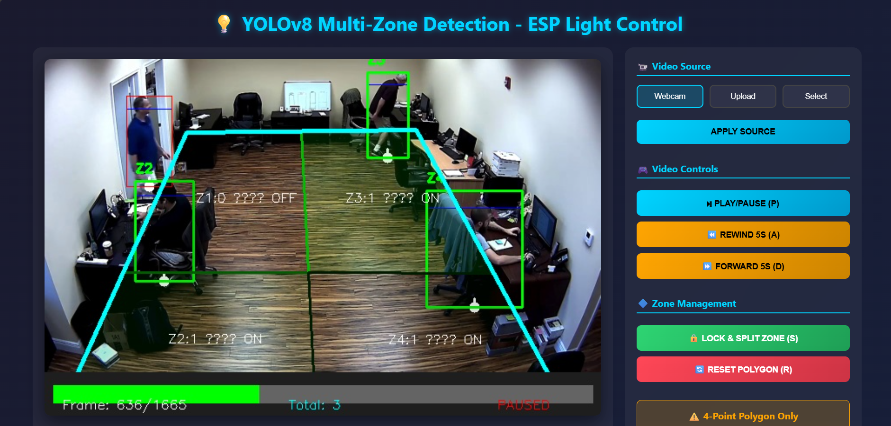
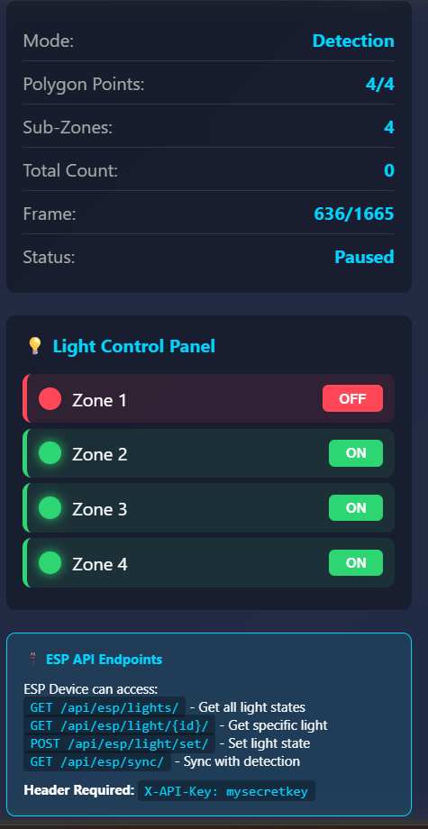

# 🏠 Smart Light Control System (YOLOv8)

AI-powered smart lighting system that detects people using **YOLOv8** and automatically controls lights based on room zones.

---

## ✨ Features

### 🧠 AI Detection

* YOLOv8 person detection
* Zone-based light control
* Real-time detection overlay

### 🖥️ Web Dashboard

* Live video streaming
* Draw custom zones
* Manual light control
* Play / Pause video

### 💡 Smart Control

* REST API for light control
* Multi-zone support
* Real-time status updates
* Scalable architecture

---

## 🛠 Tech Stack

* Python
* Django
* OpenCV
* YOLOv8
* HTML
* CSS
* JavaScript

---

## 📸 Screenshots

### Dashboard View






---

## 📂 Project Structure

```
Smart-Light-Control-System/
├── smart_light_system/     
├── monitor/
├── screenshots/
├── uploads/
├── manage.py
├── requirements.txt
├── db.sqlite3
├── .gitignore
└── yolov8n.pt
```

---

## 🚀 Installation

```bash
git clone https://github.com/hashimkasim077/Smart-Light-Control-System-.git
cd smart-lighting-system
pip install -r requirements.txt
python manage.py runserver
```

---

## ⚙️ How It Works

1. Camera captures video
2. YOLOv8 detects person
3. System checks zone
4. Backend processes logic
5. Lights turn ON / OFF automatically

---

## 🔮 Future Improvements

* Mobile app
* Cloud dashboard
* Multi-room detection
* Voice control

---

